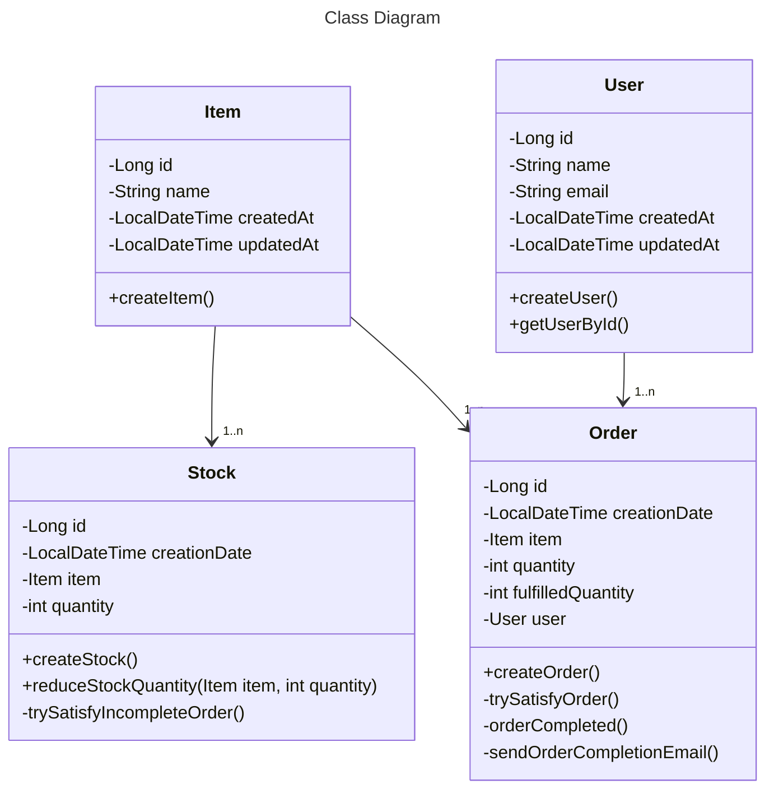

# ORDER MANAGER APPLICATION

API where users can create and manage orders. Items can be ordered and orders are automatically fulfilled as soon as the item stock allows it.


---
## Specifications or Functionalities

The system should be able to provide the following features:

- [x] create, read, update and delete and list all entities;
- [x] when an order is created, it should try to satisfy it with the current stock.;
- [x] when a stock movement is created, the system should try to attribute it to an order that isn't complete;
- [x] when an order is complete, send a notification by email to the user who created it;
- [x] trace the list of stock movements that were used to complete the order, and vice versa;
- [x] show the current completion of each order;
- [x] write a log file with orders completed, stock movements, emails sent, and errors.
---

## Additional Functionalities

- [x] junit and mockito - unit and integration test;
- [x] Docker - containerization - create application image and pull all dependent containers - postgres, pgadmin, start all with docker compose;
- [ ] customizer exception to protect application default logs with sensitive information;
- [ ] security - protect all endpoints - using spring security to authentication and authorization;
- [ ] monitoring - integration logs application with → Logstash → elasticksearch → kibana;
- [ ] CI/CD - using jenkins to automatize all the main processes;
- [ ] deploy application;

---
## CLASS DIAGRAM
Expand Class Diagram below to see full Diagram

<details>
<summary>Class Diagram - Mermeid plugin</summary>


</details>

---

## Installation

To use this project, only need to make sure those tools below are installed.

| Lib                          | Description             |
|------------------------------|-------------------------|
| `jdk-17`                     | Java Development Kit 17 |
| `jakarta 9.1`                | Enterprise Edition      |
| `JBoss/WildFly 33.0.1.Final` | Webserver               |
| `maven`                      | Dependencies Manager    |
| `docker`                     | Container Management    |

---

## Technologies

- [Jakarta EE 9.1](https://jakarta.ee/release/9.1/)
- [Maven](https://maven.apache.org/)
- [JBoss/Wildfly](https://www.wildfly.org/)
- [PostgresSQL](https://www.postgresql.org/)
- [Docker](https://www.docker.com/)

## How to Run the Application

---
- Clone the project from GitHub
```
 git clone git@github.com:fjpiedade/order-manager-jee.git
```
- Inside project folder run
```
 mvn clean package
```
---

## Easy Run using docker-compose
- inside the folder of project cloned

```
 docker compose build
```
next

```
 docker compose up -d
```

- To stop run the Project
```
 docker compose down
```
- Next test the endpoints

## Or run using hard way

- Install Postgresql - Database
- Download and configure the JBoss/WildFly - Webserver
- Build the .war and deploy in JBoss

### Postgresql using docker or local
- Install and create the order_manager as name of database.


### Configuration JBoss/WildFly Locally
- Download [JBoss/Wildfly](https://www.wildfly.org/downloads/) according to the version above.
- Install module containing the Postgresql JDBC Driver and Jakarta.API Dependencies.
- Finally, install the datasource which will connect to Postgresql
- Inside project folder can found the standalone.xml, jakarta.api dependence and postgresql driver


Next


- Start Build Docker Image - JBoss/WildFly - apply the project inside start on standalone mode
```
 docker build -t api-order .
```

- Start Docker Container - with JBoss/WildFly - apply the project inside start on standalone mode
```
 docker run -d -p 8881:8080 --name api-order-container api-order 
```
---

after run the project

Localhost root endpoint can access the API using this url [localhost:8881](http://localhost:8881/apiorder/api/v1/).

--- 

The Endpoint example end explanation can be found on a Postman document

[Postman Documentation](https://documenter.getpostman.com/view/17034847/2sAXqndj9E).


### Examples


---
## Authors

---
Fernando Piedade


