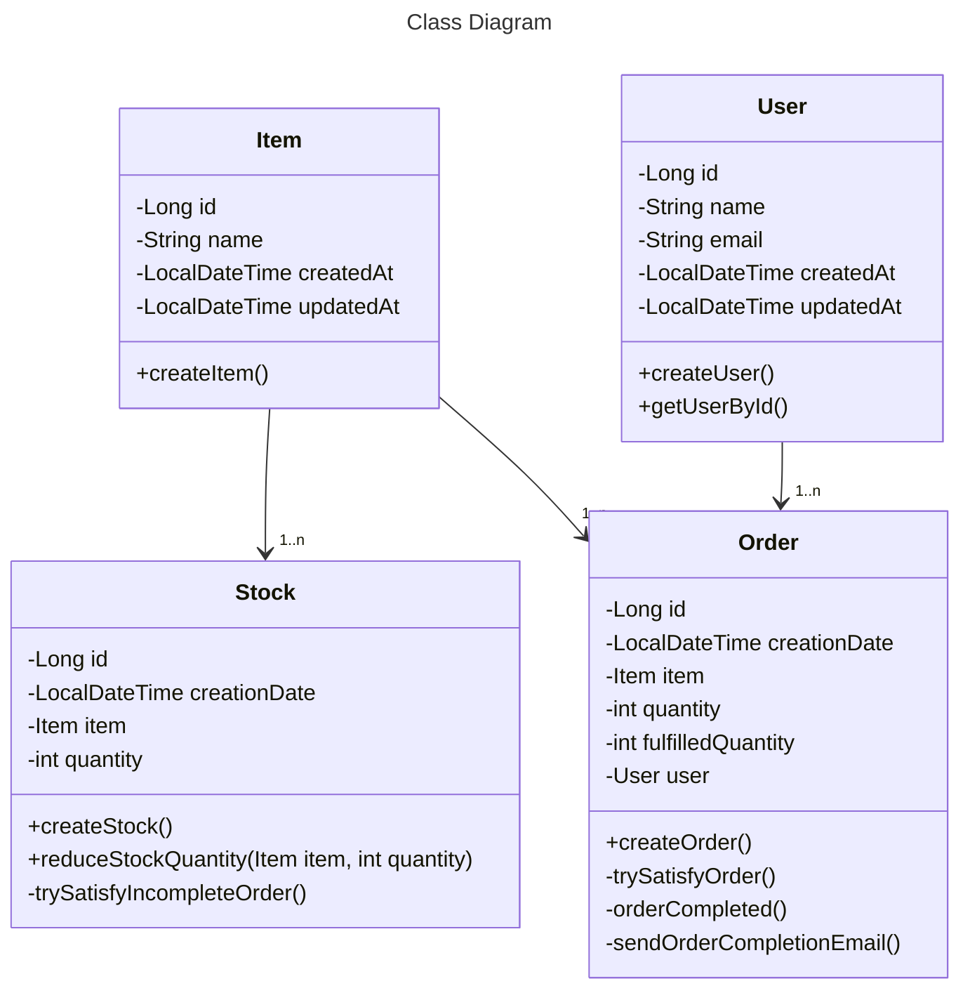

# ORDER MANAGER APPLICATION - JAKARTA EE 9.1

API where users can create and manage orders. Items can be ordered and orders are automatically fulfilled as soon as the item stock allows it.


---
## Specifications or Functionalities

The system should be able to provide the following features:

- [x] create, read, update and delete and list all entities;
- [x] when an order is created, it should try to satisfy it with the current stock.;
- [x] when a stock movement is created, the system should try to attribute it to an order that isn't complete;
- [x] when an order is complete, send a notification by email to the user who created it;
- [x] trace the list of stock movements that were used to complete the order, and vice versa;
- [x] show the current completion of each order;
- [x] write a log file with orders completed, stock movements, emails sent, and errors.

---

---
## Additional Functionalities

- [x] junit and mockito - unit and integration test;
- [x] Docker - containerization - create application image and pull all dependent containers - postgres, pgadmin, start all with docker compose;
- [ ] customizer exception to protect application default logs with sensitive information;
- [ ] security - protect all endpoints - using spring security to authentication and authorization;
- [ ] monitoring - integration logs application with → Logstash → elasticksearch → kibana;
- [ ] CI/CD - using jenkins to automatize all the main processes;
- [ ] deploy application;

---

<details>
<summary>Class Diagram - Mermeid plugin</summary>


</details>

---
## Authors

---
Fernando Piedade


## Installation

To use this project, only need to make sure those tools below are installed.

| Lib                | Description             |
|--------------------|-------------------------|
| `jdk-17`           | Java Development Kit 17 |
| `jakarta 9.1`      | Enterprise Edition      |
| `JBoss/WildFly 33` | Webserver               |
| `maven`            | Dependencies Manager    |
| `docker`           | Container Management    |

---

## Technologies

- [Spring Boot](https://spring.io/projects/spring-boot)
- [SpringDoc OpenAPI 3](https://springdoc.org/v2/#spring-webflux-support)
- [PostgresSQL](https://spring.io/projects/spring-boot)
- [Docker](https://springdoc.org/v2/#spring-webflux-support)

## How to Run the Application

### Local
- Clone the project from GitHUB repository
```
 git clone git@github.com:fjpiedade/order-manager-jee.git
```

- Inside project folder run - will execute postgresSQL
```
 docker compose up -d
```

- Stop run the Project
```
 docker compose down
```

or Run Local java app, using maven - after postgresSQL installed

```
./mvnw clean package
```
- Run:
```
java -jar api8demo/target/api8demo.jar
```

after run the project

Localhost can access the API [localhost:9090](http://localhost:9090).

Find the Swagger here [localhost:9090/swagger-ui.html](http://localhost:9090/swagger-ui/index.html)


## API Endpoints

Test using any HTTP Client, I used Postman

### Stock


### Order


### Order


HTTP requests [httpie](https://httpie.io):

- POST /api/v1/item

```
http POST :9090/api/v1/user name="User" state="State"

HTTP/1.1 200 OK
Content-Length: 129
Content-Type: application/json

{
    "email": "noname.joao@gmail.com",
    "name": "noname"
}
```


